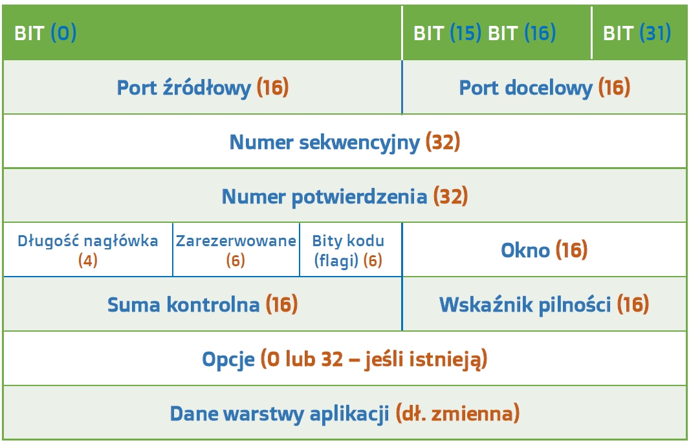
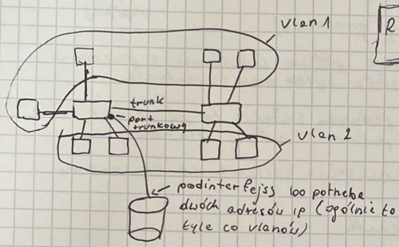

# Wyklad nr. 1 (03.03.2022)
## Tablice routingu

Budowane:

-   automatycznie - sieci bezposrdenio polaczone z routerem
-   recznie
-   dynamicznie

Dla recznych i dynamicznych typow mamy:

-   budowa:
    -   ip_route
    -   adres_sieci
    -   maska
    -   nastepny_skok:
-   typy:
    -   routing "distance vector" (RIPv1, RIPv2)
    -   routing "link-state" (OSPF)

## Pakiety TCP

TCP to złożony, połączeniowy protokół, którego użycie ma gwarantować niezawodne dostarczenie danych oraz kontrolę przepływu. W procesie enkapsulacji, do nagłówka TCP dodawanych jest aż 20 bajtów danych sterujących, ale tego wymaga niezawodność TCP. Aplikacje korzystające z tego protokołu to przeglądarki internetowe, programy pocztowe czy programy do przesyłania plików. Wzór segmentu TCP widzicie poniżej. Liczby w nawiasach oznaczają ilość bitów, zarezerwowaną dla danego pola.

*Nagłówek TCP:*


- **Port źródłowy** – port aplikacji, z której wysłano dane.
- **Port docelowy** – port aplikacji, do której wysłano dane.
- **Numer sekwencyjny** – numer ostatniego bajtu w segmencie.
- **Numer potwierdzenia** – numer następnego bajtu oczekiwanego przez odbiorcę.
- **Długość** - długość całego segmentu TCP.
- **Bity kodu (flagi)** – informacje kontrolne dotyczące segmentu.
- **Okno** - ilość danych jaka może zostać przesłana bez potwierdzenia.
- **Suma kontrolna** – używana do sprawdzania poprawności przesłanych danych.
- **Wskaźnik pilności** – używany tylko kiedy ustawiona jest flaga URG.

## Konfiguracja RIP

*Broadcastami* wysylane sa informacje o aktualnej *tablicy routingu* danego routera za pomoca protokolu *UDP*. W ten sposob routery dzialajace na *RIP* sa w stanei dolaczyc taka informacje o tablicy routingu i powiekszyc swoja tablice o dodatkowe informacje. 

> ⚠ **Do tablicy routingu zostaja dodane tylko hopy routerow sasiadujacych**

Kazda sciezka posiada swoj koszt - jezeli router otrzyma od innego routera informacje o mniej kosztownej sciezce, to dana sciazka zostaje zmieniona na ta o mniejszym koszcie.

Istnienie danej sciezki jest powtwierdzane co 30 sekund - jezeli po 6 probach nie nie dojdzie do odpowiedzi, dana sciezka zostaje zmaknieta (aka. usunieta z tablicy routingu na danym routerze)

Kiedy dochodzi do zmain w tablicy routingu?
1. Kiedy aktualnie podlaczone urzadzenia i ich adresy zostana zmienione (bezposrednie lacze)
2. Kiedy juz istniejaca sciezka zmieni swoj koszt **(od routera sasiadujacego)**
3. Kiedy pojawi sie nowa sciezka **(od routera sasiadujacego)**

---
# Wyklad nr. 2 (10.03.2022)

## IOS - system operacyjny switchej/routerów CISCO
Przy wlączaniu routera:
1. POST (Power-On Self-Test):
   - Sprawdzenie diagnostyczne 
   - Znajduje się w ROM'ie
2. Ladowanie systemu Operacyjnego, który jest lokalizowany na flash'u (`dir flash` - komenda żeby sprawdzić pliky systemu)
3. Lokalizowanie pliku z konfiguracją startową. (Jeżeli jest to jest w NVRAM)
   - jeżeli jest, to jest ladowany
   - jeżeli nie ma to pojawia sie pytanie o wlaczenie dialogu konfiguracyjnego (`dir NVRAM`)

4. Router wystartuje `Router>` (dla switcha `Switch>`), jeżeli nie ma pliku konfiguracyjnego systemu i dialog nie został uruchomiony przez administratora. Jest to **tryb użytkownika** (domyslnie nazwa urządzenia i znak '>'). W tym trybie dzialają niektóre komendy `show`:
   - `show version`
   - `show interfaces`

5. Drugi tryb - **tryb uprzywilejowany**
   ```
   Router> enable
   Router# 
   ```
   (`Router#` lub `Switch#`) Tutaj też dzialają `show`: 
   - `show running-config` 
   - `show ip-route`
   - `ping`
   - `traceroute` 
   - itd. (glębiej one już niedostepne)

6. Następny tryb - **configure terminal** 
   ```
   Router# config
   Router(config)#
   ```
   `Router(config)#` - jest to tryb konfiguracji globalnej
   > Przy wpisywaniu komend mozna podac jej tylko poczatek, np. zamiast `enable` mozna wpisac `en` i zostanie ona rozwiazana
   
   W tym trybie konfigurujemy urządzenie jako calość (np. `hostname <nazwa>` - zmieni nazwe routera). 
   Z tego trybu mozna przejść do innych trybów konfiguracji szczegolowej (np. konfiguracja haseł)

## Konfiguracja hasel:
```
Router> en
Router# conf
Router(config)# line console 0
Router(config-line)# password <password>
Router(config-line)# login
```

## Komendy konczace
- `END` - wychodzi ze wszystkich trybów do trybu uprzywilejowanego, czyli `Router#`
- `EXIT` - wychodzi do trybu użytkownika, czyli `Router>`

### HASLO NA TRYB UPRZYWILEJOWANY:
```
Router> en
Router# conf
Router(config)# enable password <password>
// aby wlaczyc szyfrowanie trzeba dopisac linijke ponizej
Router(config)# enable secret <secret> 
```

### Konfiguracja interfaców:

```
Router> en
Router# conf
Router(config)# interface <name>
Router(config-if)# ip address <ip> <mask>
Router(config-if)# no shutdown
```

Domyslnie interfejsy nie sa podnoszone, `no shutdown` probuje podniść interfejs

config - router rip 
version 2
network .. (wpisanie bezposrednio sieci polączone do routera)

## Routing

### OSPF

```
Router> en
Router# conf
Router(config)# router ospf <process_id>
Router(config-router)# network <network_ip> <network_mask> area <area_id>
```
- **process_id** - nadajemy sami, pod tym numerem precesu bedzie dzialal ospf
- **network_ip** - IP sieci
- **network_mask** - maska sieci
- **area_id** - nadajemy sami

### RIP v2

```
Router> en
Router# conf
Router(config)# router rip
Router(config-router)# version 2
Router(config-router)# network <network_ip>
```
- **network_ip** - IP sieci
---
# Wyklad nr. 3 (17.03.2022)

## Switche

Switcz otrzymuje sygnal, umie odczytać ramkę (mac celu, mac żródła, protokół, Dane, CRC) 
Dane - pakiet warstwy 3, nie umie tego odczytać.

Przelączniki mają tablicę mac-adressów. 
W momencie otrzymania ramki, szuka mac-adress w swojej tablicy, jeżeli istnieje, to (tablica maje wszystkie porty skojarzone z mac-adresami),
znaczy, że to urządzenie jest polączone i wysyła do tego portu, do którego jest polączane urządzenie.
Jeżeli takiego portu niema, to switch działa jak koncentrator i wysyła to do wszystkich portów, opróć tego portu skąd przyszedła ramka.

12-f (40 jedynek - fizyczny broadcast na switchu) - to inna opcja, kiedy to jest wysyłane wszędzie.

Na switchu, komputer jest dodany do tablicy wtedy, gdy komputer chce coś wysłać. Switch analizuje mac-adress żródła, żeby wiedzie, że komputer jest polączony do tego portu
--Na jednym porcie może być więcej mac-adressów, ałe nie może być jeden mac-adress na wielu portach.
Switch aktualizuje port komputera, jeżeli ten coś wyśle z nowego portu. Jeżeli na jakiś adress nie idą pakiety 300 sekund, to po prostu komputer jest wyrzucany z tablicy.


Switch ma podobne CLI (enable)

show mac-address-table - polecenie pokazaju tablice mac-adressów tego switcha

Na switchach zarządzłnych można było robić wpisy statyczne do tej tablict mac-addressowej, można naprzykład zrobić przypisanie tyłko jednego mac-addresu do jednego portu (inne urządzeni będą nieosiągałne)

Jeżeli na przelącznikach są VLAN, to jeden switch - to jest kiłka switchów (VLAN - jest odcięty od innych VLAN'ów switch)
Wtedy tablicy mac są lokałne dla każdego VLAN. (Jeden VLAN nie widzi portów innych VLANów. Nie wołno im wysyłać pomiedzy portami różnych VLAN i też to dotyczy broadcastów (broadcast działa tyłko dla porów jednego VLAN))

## VLAN
Slużą dla tego żeby odseparować rózne grupy urządzeń. 

Te VLAN mogą być tworzone na różnych poziomach, na MAC adresach, na podstawie addresów IP (Końcowe urządzenie decyduję czy należy do potrzebnego VLAN)

Na CISCO switchach VLAN definiują się na portach

show VLAN (VLAN > 1000 - węwnetrzna komunikacja, nas to nie interesuje) 
Kiedy odwolujemy się do VLAN to odwolujemy do jego numeru. (Pierwszy VLAN defaultowo nazywa się default)
Domysłnie wszystkie porty należa do jednego VLAN

conf t
vlan 10 (10 - numer)
end - kończy ustawienie tego VLAN'u

jeżeli nie dać nazwy (to VLAN będzie nazywać tak: "VLAN10" - 10 numer)

(config-vlan) name - żeby zmienić nazwe

--------Przypisanie portu do VLAN
Przez konfiguracje interface'u przypisujemy port do VLAN'u. (Jeżeli nie jest przez nas przypisania, to port jest przypisany do VLAN1 default)


Przypisanie jednego interface'u
/*
conf t
interface f0/10
switchport mode access
switchport access vlan 10 
*/


Przypisanie grupy portów do vlan (configuracja kilku interfaców)
/*
conf t
interface range f0/11, f0/12, f0/15-17
(config-if-range)#switchport mode access vlan 10
exit
*/

Polączyć 2 switcza 2 kablamy, ale odrazu jeden interface nie podniose sie, bo będzie pętla (spanning-tree zablokuje jeden interface)
Ale kiedy będą w różnych VLAN'ach, to pętli nie będzie.
Wadą jest to, że jest potrzebno tyłe polączeń (kabli) ile jest VLANów.
(To dla trybów access - jeden port do jednego VLAN)

Tryb TRUNK pozwała, że port może być do różnych VLAN'ów, lub wszystkich
(Jedno polączenie fizyczne dla wszystkich VLAN (domyślnie dla wszystkich)
### Przelaczenie switcha w tryb `trunk`
```
Switch# switchport mode trunk
```
Trunk nie jest w żadnem VLAN'ie w tablice (show VLAN)

### Pokazanie wszystkich interfejsow `trunk`
```
Switch# show interface trunk
```

Trunk automatycznie może być zrobiony trunkiem na drugim switch (porty są w trybie negocjacji (jeżeli jest jeden `trunk`, a drugi jest `access`, to odrazu będzie `trunk`, ale nie zawsze, zalezy od tabeli cisco, do znalezienia na stronie cisco)

## Trunk
Trunk powoduje, żę lącze nie jest zwykłym lączem internetowym, bo lącze trankowe musi wiedzieć z jakiego portu przyśla ramka.
Obsluga dodatkowego protokolu, zmieniona ramka.
Ramka jest zmieniana przy wyjściu z jednego switch'a i odwrotnie zmieniana na drugim końcu lącza trankowego i dałej jest wysyłana jako zwykła ramka, bo tyłko switch umie jej obslugiwać.

Jeden protokoł ISL (dopisuje do ramki internetowej info o VLAN, nie jest stosowany)

**802.1q** - standartny protokól (na naszych switchach, innego nawet nie da się innego robić, na starszych jeszcze można) (Zmodyfikowana ramka internetowa)

Switch warstwy 3 lub router - to jedyna opcja, kiedy można polączyć urządzenia różnych VLANów (obowiązkowe jest urządzenie warstwy 3)
Jeżeli to jest potrebne, to trzeba żeby adresy różnych VLAN'ów muszą mieć adresy innych sieci, bo będą po różnych stronach routera.
Jeżeli te urządzenia nigdy nie będą komunikować pomiędzy sobą, to można nawet dać jednakowe adresy

Jeżeli w serwerze jest karta sieciowa która wspiera ISL/802.1q można było zrobić by trunk też.
Lub przez router.
(Router polączony do różnych VLAN'ów, zaadresować interface'y, ustawic Default GateWay na pc)

To jest robione, żeby na routerze można było zrobić ACL (Access Control List)
Żeby komputer innego VLAN miał dostęp tyłko do serwera i nie do innych komputerów.

Bez ACl, podział na VLAN has no sense, bo wszystkie komputery mogą komunikować przez router.

## ERASE NVRAM: 

```
delete VLAN.DAT
```

---
# Wyklad nr. 4 (24.03.2022)

## ACL 

**Lista kontroli dostepu** (Access Control List) - jest to zbior regul decydujacy o zablokowaniu lub przepuszczeniu ruchu na routerze (pakiety sa wysylane badz nie na podstawie tej listy)

Reguly sa stosowane w kolejnosci wystepowania na liscie (zawsze sa tylko dwa rodzaje regul, pozwalajace lub blokujace).

Na samym koncu listy znajduje sie regula ktora blokuje ruch z reszty niokreslonych kryterii.

Lista jest przypisywana do konkretnego:
- **protokolu**
- **interfejsu**
- **kierunku ruchu** (czy wchodzacy czy wychodzacy przez dany interfejs)

Rodzaje list:
- listy numerowane
  - listy standardowe (dla IP numery od 1 do 99)
    - ubogie, pozwalaja filtrowac tylko po adresie zrodlowym
  - listy rozszerzone (dla IP numery od 100 w gore)
    - pozwalaja na filtrowanie po:
      - protokole (IP, UDP, TCP, ICMP)
      - adresie zrodlowym 
      - adresie docelowym
      - dla UDP i TCP:
        - po porcie zrodlowym
        - po porcie docelowym

Sprawdzenie list ACL:
```
Router# sh ip access-lists
```

Config **ACL standardowej** na routerze: 
```
Router(config)# acc
Router(config)# access-list 1 permit host 200.0.0.3
```

Struktura comendy *access-list* dla ACL standardowego:
- numer listy
- typ reguly: 
  - permit 
  - deny 
  - remark (komentarz)
- jedno z ponizszych:
  - A.B.C.D (adress ip)
    - maska adresu w formacie A.B.C.D (0.0.0.0 - oznacza przypisanie tylko tego adresu, 255.255.255.255 oznacza dowolny adress (dziala to odwrotnie do maski sieci, np dla 200.0.0.100 0.0.0.63 dostaniemy regule dzialajaca na adresach od 200.0.0.64 do 200.0.0.127))
  - host A.B.C.D
  - any (dowlone)

Config **ACL rozszerzonej** na routerze: 
```
Router(config)# acc
Router(config)# access-list 100 permit tcp any 200.0.0.3 0.0.0.0 eq www
```

Struktura comendy *access-list* dla ACL rozszerzonego:
- numer listy
- typ reguly:
  - permit 
  - deny 
  - remark (komentarz)
- jedna z opcji:
  - ahp    Authentication Header Protocol
  - eigrp  Cisco's EIGRP routing protocol
  - esp    Encapsulation Security Payload
  - gre    Cisco's GRE tunneling
  - icmp   Internet Control Message Protocol
  - ip     Any Internet Protocol
  - ospf   OSPF routing protocol
  - tcp    Transmission Control Protocol
  - udp    User Datagram Protocol
- jedna z opcji:
  - A.B.C.D  Source address
    - A.B.C.D  Source wildcard bits
  - any      Any source host
  - host     A single source host
    - A.B.C.D  Source address

---
# Wyklad nr. 5 (31.03.2022)

## Router on the Stick



### Ustawianie podinterfejsow

```
Router(config)# interface f0/0.1
Router(config-subif)# encapsulation dot1q 1
Router(config-subif)# ip address <ip> <mask>
```
> `dot1q` to jedna z opcji `encapsulation`

### **DTP** - Dynamic Trunking Protocol

Powoduje automatyczne ustawienie trunka po drugiej stronie. Komenda:

```
Switch# switchport nonegotiate
```

wyłącza **DTP**.

### Rozpiska komendy `Switch# switchport mode ...`

|Switch_1 > Switch_2 v|Dynamic auto|Dynamic desirable|Trunk|Access|
|---|---|---|---|---|
|**Dynamic auto**|Access|Trunk|Trunk|Access|
|**Dynamic desirable**|Trunk|Trunk|Trunk|Access|
|**Trunk**|Trunk|Trunk|Trunk|Limited connectivity|
|**Access**|Access|Access|Limited connectivity|Access|

### **VTP** - Vitual Trunking Protocol

Protokol zarzadzania VLAN'ami (VLAN'y staja sie wspolne)

Ulatwia zarzadzanie VLAN'ami z poziomu jednego switch'a. Dziala tylko przy trunk'ach.

Jezeli zrobimy na jednym switchu to na reszcie zrobi sei samo, reszta dostanie ino o VLAN'ach.

Jak dziala to wszystkie switch'e sa serwerami tego protokolu.

Pokazanie informacji o stanie **VTP**:
```
Switch(config)# show vtp status
```

Serwer pozwala na tworzenie VLAN'ów i zarzadzanie nimi. 

Zmiana na tryb klienta oraz przydzielenie domeny:
```
Switch(config)# vtp mode client
Switch(config)# ctp domain <nazwa_domeny>
```

---
# Wyklad nr. 6 (07.04.2022)


